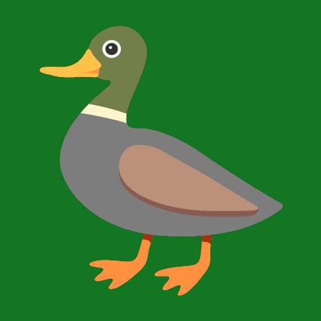

# Hunt ducks on Matrix.

This is the source code of the DuckHunTrix Matrix bot.

Maintained by [Cyanic76](https://cyanic.me), written in JS (NodeJS).

# Why DuckHunTrix?

- It's FOSS.
- Data is kept locally and isn't uploaded anywhere to anyone.
- It's easy to selfhost it and to edit its configuration file.
- It uses up-to-date NPM dependencies.
- There's a [documentation](https://cyanic76.gitbook.io/duckhuntrix).

# Getting started

The main command is `!bang`. Use it to shoot at ducks, when one or more of them are in the Matrix room. [Learn more](https://cyanic76.gitbook.io/duckhuntrix/features/getting-started) about this in the documentation.

Get your statistics using one command; `!me`. [Learn more here](cyanic76.gitbook.io/duckhuntrix/features/commands#me).

Don't want to use the official bot? [Host it by yourself](https://cyanic76.gitbook.io/duckhuntrix/admin/selfhost).

# Contribute

Contributions are welcome!
[Guidelines](https://cyanic76.gitbook.io/duckhuntrix/contributing)
